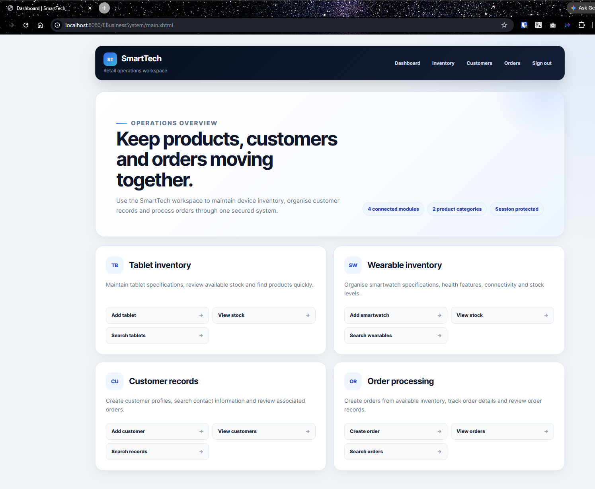
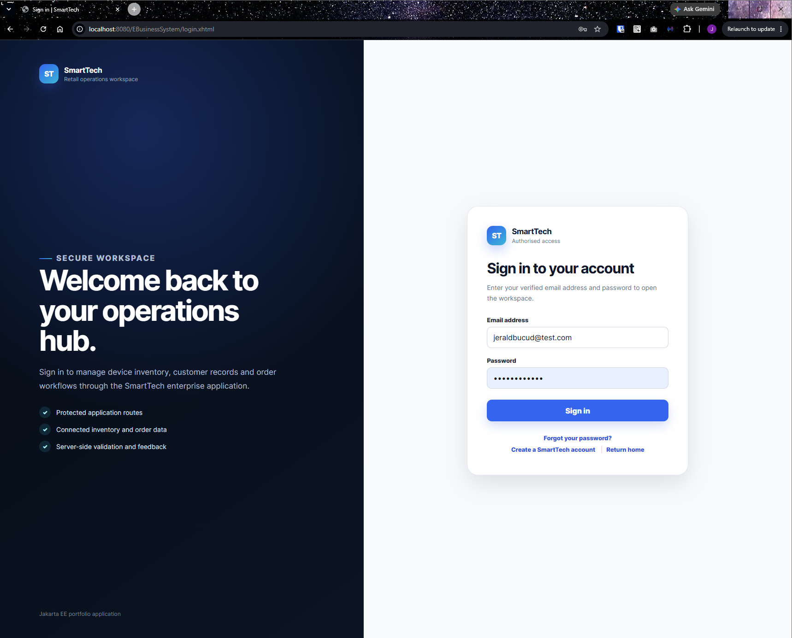
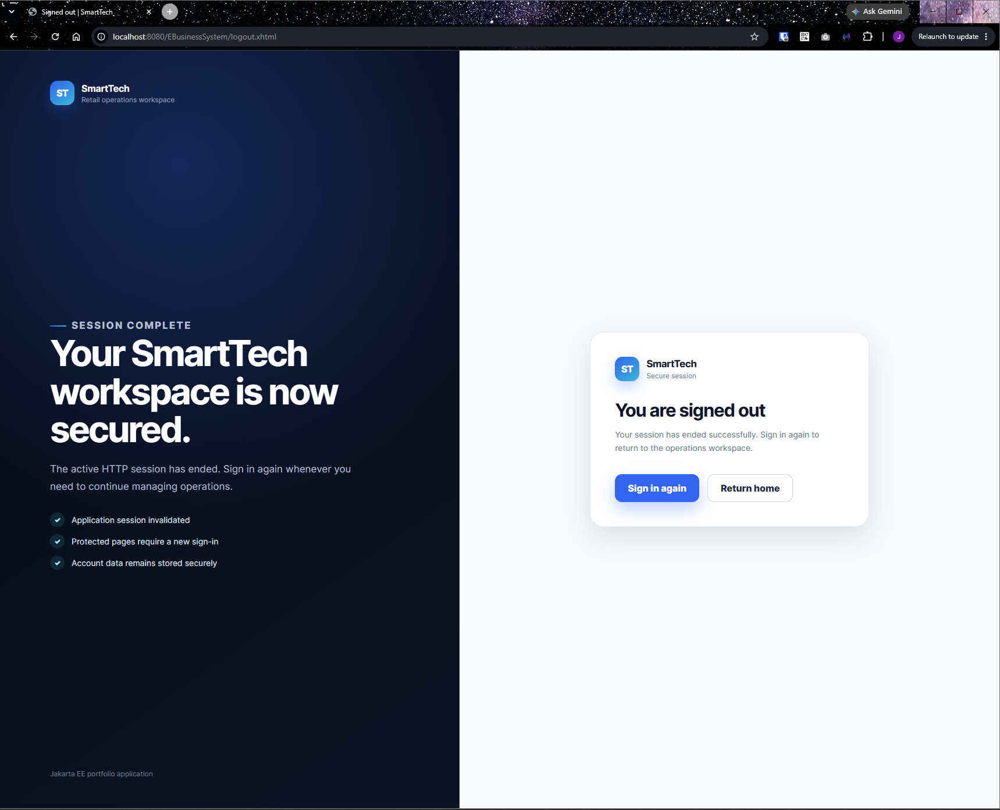
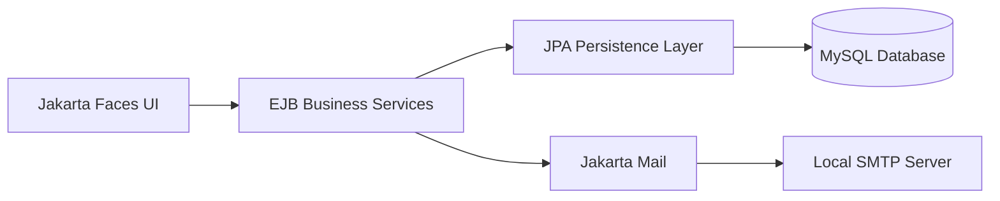
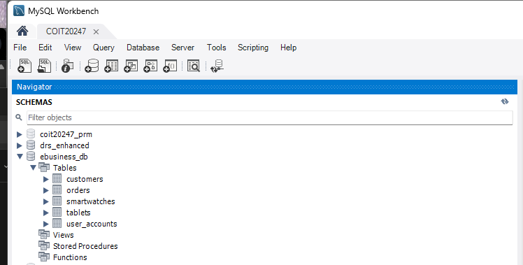

# SmartTech E-Business Management System

A secure three-tier retail operations workspace for managing technology inventory, customer records and customer orders. SmartTech demonstrates enterprise Java development through a server-rendered Jakarta EE application with authentication, layered business services and relational data persistence.

> **Portfolio edition:** This repository preserves the original team contribution history while presenting the application as a standalone product. My primary focus was the Jakarta Faces presentation layer, authentication workflows and access control.

## Application Preview

### Operations Dashboard

The secured dashboard provides direct access to tablet inventory, smartwatch inventory, customer records and order-processing workflows.



<table>
  <tr>
    <td width="50%">
      <strong>Secure Account Access</strong><br><br>
      
    </td>
    <td width="50%">
      <strong>Session Sign-out</strong><br><br>
      
    </td>
  </tr>
</table>

## Overview

SmartTech supports the core operations of a small technology retailer. Authorised users can maintain tablet and smartwatch stock, manage customer records and process customer orders through a consistent web interface.

The application includes account registration and verification, protected application pages, customer management, product stock management and order processing. Jakarta Faces handles the presentation layer, EJB services contain business logic and Jakarta Persistence manages relational data through MySQL.

## Features

- User registration and email verification
- Login, logout and session-protected pages
- Account recovery and password reset
- Customer creation, listing, search and detail views
- Tablet and smartwatch inventory management
- Customer order creation, listing, search and detail views
- Server-side form validation and user feedback
- Responsive interfaces for public, authentication and management pages
- Layered separation between presentation, business and persistence logic
- Local email testing through FakeSMTP

## Architecture



### Relational Data Model

The database stores user accounts, customers, technology products and customer orders using linked MySQL tables.



## Technology Stack

| Area | Technologies |
| --- | --- |
| Language | Java 11 |
| Platform | Jakarta EE 10 |
| Presentation | Jakarta Faces, Facelets, CSS |
| Business layer | Enterprise JavaBeans |
| Persistence | Jakarta Persistence, EclipseLink |
| Database | MySQL 8 |
| Application server | GlassFish 7 |
| Email | Jakarta Mail, FakeSMTP |
| Build | Maven |
| Development | Apache NetBeans, Git, GitHub |

## My Contributions

My primary responsibilities in the team project included:

- Designing and implementing Jakarta Faces pages for authentication and system-management workflows
- Building presentation-layer backing beans and connecting them to the EJB business layer
- Integrating login, registration, verification, account recovery and password-reset flows
- Implementing session-based access control with a servlet filter
- Adding secure logout behaviour through HTTP-session invalidation
- Developing page navigation, data-table presentation, forms and responsive interface styling
- Implementing the local email service used for verification and recovery messages
- Transforming the assessment interface into the portfolio-ready SmartTech product experience
- Contributing through feature branches, pull requests and reviewed merges

The original Git history is preserved so that contributions from every team member remain attributable.

## Repository Structure

```text
smarttech-ebusiness-system/
├── EBusinessSystem/
│   ├── src/main/java/
│   │   ├── com/ebusiness/presentation/       # JSF backing beans
│   │   ├── com/ebusiness/security/           # Request access filter
│   │   └── cqu/coit20259/ebusiness/
│   │       ├── business/                     # EJB services
│   │       └── persistence/                  # JPA entities
│   ├── src/main/resources/META-INF/          # Persistence configuration
│   ├── src/main/webapp/                      # Facelets pages and web assets
│   └── pom.xml
├── docs/
│   ├── Images/screenshots/                   # Portfolio screenshots
│   └── SETUP.md                              # Local development guide
└── README.md
```

## Running the Project

The application requires GlassFish, MySQL and a local SMTP testing server. Detailed instructions are available in [docs/SETUP.md](docs/SETUP.md).

The Maven project is located inside the `EBusinessSystem` directory:

```bash
cd EBusinessSystem
mvn clean package
```

After deployment to GlassFish, the application is normally available at:

```text
http://localhost:8080/EBusinessSystem/
```

## Academic Context and Attribution

This application was originally completed for **COIT20259, Applied Distributed Systems**, as a collaborative university assessment. It is presented here as a portfolio edition, not as a claim of sole authorship.

- Team contributions remain visible in the commit history.
- The sections above identify my primary areas of responsibility.
- Assessment-specific branding and internal setup notes were replaced with maintainable product documentation.
- The running application was redesigned and rebranded as SmartTech for portfolio presentation.

## Current Limitations

This is an educational application and is not currently intended for production deployment. Future improvements would include:

- Adaptive password hashing such as PBKDF2, BCrypt or Argon2
- Cryptographically secure verification-code generation
- Environment-based database and SMTP configuration
- Automated unit, integration and browser tests
- Containerised local setup
- Continuous integration and deployment checks
- Further accessibility testing

## Project Status

The original assessment functionality is complete. The portfolio edition now includes product-focused branding, a redesigned responsive frontend, cleaned documentation and application screenshots. Further improvements can focus on automated testing, security hardening and deployment portability.
