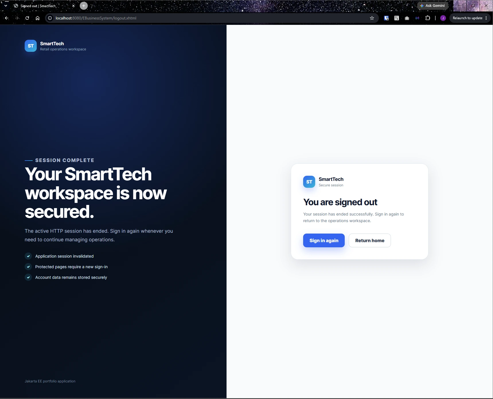
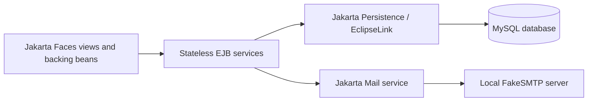
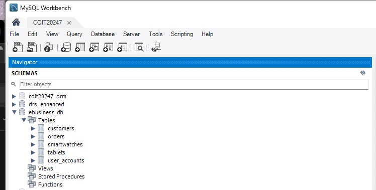

# SmartTech E-Business Management System

[](https://github.com/JeraldBucud/smarttech-ebusiness-system/actions/workflows/maven-build.yml)

SmartTech is a server-rendered Jakarta EE application for authenticated access, customer records, tablet and smartwatch inventory, and stock-aware customer orders.

The application was developed collaboratively for **COIT20259: Applied Distributed Systems**. My work focused on Jakarta Faces presentation components, authentication-related integration, local email delivery, customer-profile routing and interface consistency.

## Application preview

### Operations dashboard

The authenticated dashboard links the inventory, customer and order-management modules.


<table>
  <tr>
    <td width="50%">
      <strong>Authenticated account access</strong><br><br>
      
    </td>
    <td width="50%">
      <strong>Session sign-out</strong><br><br>
      
    </td>
  </tr>
</table>

## Main capabilities

- Account registration and email verification
- Login, logout and session-protected management pages
- Account recovery and password reset
- Customer creation, listing, search and selected-profile views
- Tablet and smartwatch inventory management
- Customer order creation, listing, search and detail views
- Stock deduction when an order is created
- Stock restoration when an order is deleted
- Server-side form validation and user feedback
- Responsive authentication and management interfaces
- Local verification and recovery email delivery through FakeSMTP

## Architecture



- **Presentation tier:** Jakarta Faces, Facelets, CDI and presentation backing beans
- **Business tier:** stateless EJB services for accounts, customers, products, orders and email
- **Persistence tier:** Jakarta Persistence with EclipseLink, JTA and the `jdbc/ebusiness_db` data source
- **Deployment:** WAR package on GlassFish 7
- **Build verification:** Maven `clean verify` through GitHub Actions with Java 11

### Relational data model

The database stores user accounts, customers, tablets, smartwatches and orders.



The order entity stores customer and product IDs rather than mapped JPA relationships.

## Technology stack

| Area | Technologies |
| --- | --- |
| Language | Java 11 |
| Platform | Jakarta EE 10 |
| Presentation | Jakarta Faces, Facelets, CSS |
| Business layer | Enterprise JavaBeans |
| Persistence | Jakarta Persistence, EclipseLink, JTA |
| Database | MySQL 8 |
| Application server | GlassFish 7 |
| Email | Jakarta Mail, FakeSMTP |
| Build and CI | Maven, GitHub Actions |
| Development | Apache NetBeans, Git, GitHub |

## My contribution

My implementation work includes:

- Authentication pages for registration, verification, login, recovery, password reset and logout
- `AuthenticationBean` integration with the account and email services
- A servlet filter that redirects unauthenticated management requests to login
- Presentation backing beans for customers, tablets, smartwatches and orders
- Jakarta Faces forms, tables, navigation and validation feedback
- Local Jakarta Mail delivery for verification and recovery codes
- Customer list and search links that pass the selected customer ID to the profile view
- Responsive SmartTech styling across authentication and management pages
- Public setup and screenshot documentation

The business and persistence layers include contributions from the project team. The original commit history remains available.

## Order and inventory workflow

1. The user selects a customer, product type, product and quantity.
2. The presentation bean parses the submitted values and creates an order object.
3. The order service asks the product service to check and deduct recorded stock.
4. The order is persisted after the stock operation succeeds.
5. Deleting an order restores the recorded quantity before removing the order.

## Repository structure

```text
smarttech-ebusiness-system/
├── .github/workflows/                        # Maven build verification
├── EBusinessSystem/
│   ├── src/main/java/
│   │   ├── com/ebusiness/presentation/       # Jakarta Faces backing beans
│   │   ├── com/ebusiness/security/           # Authenticated-page filter
│   │   └── cqu/coit20259/ebusiness/
│   │       ├── business/                     # EJB services
│   │       └── persistence/                  # JPA entities
│   ├── src/main/resources/META-INF/          # Persistence configuration
│   ├── src/main/webapp/                      # Facelets pages and web assets
│   └── pom.xml
├── docs/
│   ├── Images/screenshots/                   # Application and schema screenshots
│   └── SETUP.md                              # Local development guide
└── README.md
```

## Local setup

The application requires GlassFish 7, MySQL 8 and a local SMTP testing server. Detailed instructions are available in [docs/SETUP.md](docs/SETUP.md).

Build the WAR from the Maven project directory:

```bash
cd EBusinessSystem
mvn clean package
```

After deployment to GlassFish, the application is normally available at:

```text
http://localhost:8080/EBusinessSystem/
```

## Current constraints

- Passwords are stored as unsalted SHA-512 digests rather than a password-hashing function with a configurable work factor.
- Verification and recovery codes use `java.util.Random` and have no persisted expiry or attempt-limit fields.
- The login filter checks for an authenticated session; the stored account group is not used for role-based permissions.
- Search functions load full record lists and filter them in presentation backing beans.
- Order quantity is parsed from text, and the business layer does not explicitly reject zero or negative values.
- Orders store customer and product IDs only and do not persist status, notes or timestamps.
- The GitHub workflow verifies the Maven build, but automated unit, integration and browser tests are not included.
- Local execution requires GlassFish, MySQL and FakeSMTP; the SMTP host and port are fixed in the email service.

## Next engineering steps

- Adopt a salted password-hashing function with a configurable work factor.
- Generate cryptographically secure, expiring verification and recovery codes with attempt limits.
- Add role-based permissions for administrative and operational actions.
- Validate positive order quantities and test stock deduction, failure and restoration.
- Move search criteria into database queries and add pagination.
- Model customer and product relationships and persist a fuller order lifecycle.
- Externalise SMTP settings and add automated unit, integration and browser tests.

## Academic context

SmartTech was completed as a collaborative university assessment for **COIT20259: Applied Distributed Systems**. Team contributions remain visible in the commit history, while the sections above identify my implementation areas.

## Author

**Jerald Christopher Bucud**  
Master of Information Technology candidate majoring in Software Design and Development, with a minor in Artificial Intelligence.
