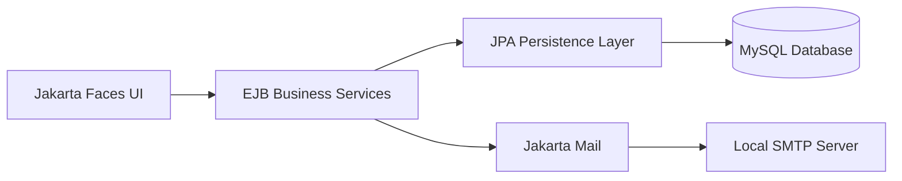

# SmartTech E-Business Management System

A three-tier e-business web application for managing customers, technology products, stock and customer orders. The system was developed with Jakarta EE as a university team project and has been retained as a portfolio project to demonstrate enterprise Java development, layered architecture and collaborative Git workflows.

> **Project type:** Academic team project  
> **Primary portfolio focus:** Jakarta Faces presentation layer, authentication workflows and access control

## Overview

SmartTech E-Business Management System supports the core operations of a small technology retailer. It provides account registration and verification, protected application pages, customer management, product stock management and order processing through a server-rendered Java web interface.

The application follows a three-tier architecture:



## Features

- User registration and email verification
- Login, logout and session-protected pages
- Account recovery and password reset
- Customer creation, listing and search
- Tablet and smartwatch inventory management
- Customer order creation, listing and search
- Server-side form validation and user feedback
- Layered separation between presentation, business and persistence logic
- Local email testing through FakeSMTP

## Technology Stack

| Area | Technologies |
| --- | --- |
| Language | Java 11 |
| Platform | Jakarta EE 10 |
| Presentation | Jakarta Faces, Facelets, CSS |
| Business layer | Enterprise JavaBeans |
| Persistence | Jakarta Persistence, EclipseLink |
| Database | MySQL 8 |
| Application server | GlassFish 7 |
| Email | Jakarta Mail, FakeSMTP |
| Build | Maven |
| Development | Apache NetBeans, Git, GitHub |

## My Contributions

My primary responsibilities in the team project included:

- Designing and implementing Jakarta Faces pages for authentication and system-management workflows
- Building presentation-layer backing beans and connecting them to the EJB business layer
- Integrating login, registration, verification, account recovery and password-reset flows
- Implementing session-based access control with a servlet filter
- Adding secure logout behaviour through HTTP-session invalidation
- Developing page navigation, data-table presentation, forms and responsive interface styling
- Implementing the local email service used for verification and recovery messages
- Contributing through feature branches, pull requests and reviewed merges

The original Git history is preserved so that contributions from every team member remain attributable.

## Repository Structure

```text
smarttech-ebusiness-system/
├── EBusinessSystem/
│   ├── src/main/java/
│   │   ├── com/ebusiness/presentation/       # JSF backing beans
│   │   ├── com/ebusiness/security/           # Request access filter
│   │   └── cqu/coit20259/ebusiness/
│   │       ├── business/                     # EJB services
│   │       └── persistence/                  # JPA entities
│   ├── src/main/resources/META-INF/          # Persistence configuration
│   ├── src/main/webapp/                      # Facelets pages and web assets
│   └── pom.xml
├── docs/
│   └── SETUP.md                              # Local development guide
└── README.md
```

## Running the Project

The application requires GlassFish, MySQL and a local SMTP testing server. Detailed instructions are available in [docs/SETUP.md](docs/SETUP.md).

The Maven project is located inside the `EBusinessSystem` directory:

```bash
cd EBusinessSystem
mvn clean package
```

After deployment to GlassFish, the application is normally available at:

```text
http://localhost:8080/EBusinessSystem/
```

## Academic Context and Attribution

This application was originally completed for **COIT20259, Applied Distributed Systems**, as a collaborative university assessment. It is presented here as a portfolio copy, not as a claim of sole authorship.

- Team contributions remain visible in the commit history.
- The sections above identify my primary areas of responsibility.
- Assessment-specific setup notes have been replaced with maintainable portfolio documentation.

## Current Limitations

This is an educational application and is not currently intended for production deployment. Future improvements would include:

- Adaptive password hashing such as PBKDF2, BCrypt or Argon2
- Cryptographically secure verification-code generation
- Environment-based database and SMTP configuration
- Automated unit, integration and browser tests
- Containerised local setup
- Continuous integration and deployment checks
- Accessibility and responsive-interface review

## Project Status

The original assessment implementation is complete. This portfolio version is being improved through documentation, security review, screenshots and maintainability updates.
