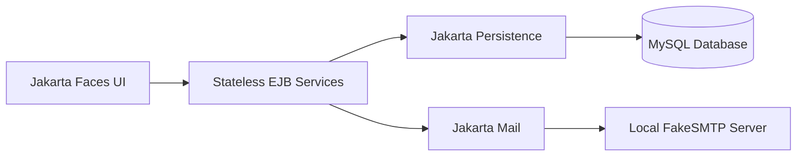

# SmartTech E-Business Management System

[](https://github.com/JeraldBucud/smarttech-ebusiness-system/actions/workflows/maven-build.yml)

SmartTech is a collaborative Jakarta EE retail-operations application for authenticated account access, customer records, tablet and smartwatch inventory, and stock-aware order processing. It uses a three-tier architecture with Jakarta Faces, stateless EJB services, Jakarta Persistence and MySQL.

**Case study:** https://jeraldbucud.com/smarttech-ebusiness-system-case-study.html

## Application preview

### Operations dashboard

The authenticated dashboard provides access to tablet inventory, smartwatch inventory, customer records and order-processing workflows.


<table>
  <tr>
    <td width="50%">
      <strong>Authenticated Account Access</strong><br><br>
      
    </td>
    <td width="50%">
      <strong>Session Sign-out</strong><br><br>
      
    </td>
  </tr>
</table>

## System scope

The application supports the core operations of a small technology retailer:

- User registration and email verification
- Login, logout and session-protected management pages
- Account recovery and password reset
- Customer creation, listing, search and selected detail views
- Tablet inventory management
- Smartwatch inventory management
- Customer order creation, listing, search and detail views
- Stock deduction when an order is created
- Stock restoration when an order is deleted
- Local email testing through FakeSMTP
- Responsive authentication and management interfaces

The application is an internal management workspace rather than a customer-facing online shop.

## Architecture



### Application tiers

| Tier | Responsibility |
| --- | --- |
| Presentation | Jakarta Faces pages, backing beans, form state, navigation and feedback |
| Business | Stateless EJB services for accounts, customers, products and orders |
| Persistence | Jakarta Persistence entities using EclipseLink and a JTA data source |
| Database | MySQL tables for accounts, customers, tablets, smartwatches and orders |

### Relational data model


The order entity stores customer and product identifiers directly rather than mapped JPA relationships.

## Technology stack

| Area | Technologies |
| --- | --- |
| Language | Java 11 |
| Platform | Jakarta EE 10 |
| Presentation | Jakarta Faces, Facelets, CSS |
| Business layer | Enterprise JavaBeans |
| Persistence | Jakarta Persistence, EclipseLink |
| Database | MySQL 8 |
| Application server | GlassFish 7 |
| Email | Jakarta Mail, FakeSMTP |
| Build and CI | Maven, GitHub Actions |
| Development | Apache NetBeans, Git, GitHub |

## Authentication model

The application uses session-based authentication:

- Registration creates an account record and sends a verification code through the local email service.
- Login stores the authenticated account in the HTTP session.
- A servlet filter allows public pages and static assets while redirecting unauthenticated management requests to the login page.
- Logout invalidates the HTTP session.

The stored account group is not currently used to enforce different role permissions.

## Order and stock workflow

1. Select a customer.
2. Select a tablet or smartwatch.
3. Enter the requested quantity.
4. Check whether recorded stock is sufficient.
5. Deduct the quantity through the product service.
6. Persist the order.
7. Restore the quantity if the order is deleted.

The business layer does not currently reject zero or negative order quantities explicitly.

## My contribution

My work in the collaborative project focused on the Jakarta Faces presentation layer and application integration:

- Implemented authentication pages and the `AuthenticationBean` for registration, verification, login, recovery, reset and logout
- Added the servlet `LoginFilter` for session-protected management pages
- Implemented customer, tablet, smartwatch and order presentation beans
- Connected forms, tables and search views to the team’s EJB services
- Implemented local verification and recovery email delivery with Jakarta Mail and FakeSMTP
- Corrected customer-profile navigation by passing and loading the selected customer ID
- Applied consistent responsive styling, navigation and feedback patterns
- Contributed through feature branches, pull requests and reviewed merges

The business and persistence layers include collaborative contributions. The original Git history remains available for reviewing team work.

## Repository structure

```text
smarttech-ebusiness-system/
├── .github/workflows/                        # Maven build verification
├── EBusinessSystem/
│   ├── src/main/java/
│   │   ├── com/ebusiness/presentation/       # Jakarta Faces backing beans
│   │   ├── com/ebusiness/security/           # Authenticated-page filter
│   │   └── cqu/coit20259/ebusiness/
│   │       ├── business/                     # EJB services
│   │       └── persistence/                  # JPA entities
│   ├── src/main/resources/META-INF/          # Persistence configuration
│   ├── src/main/webapp/                      # Facelets pages and web assets
│   └── pom.xml
├── docs/
│   ├── Images/screenshots/                   # Application and schema screenshots
│   └── SETUP.md                              # Local development guide
└── README.md
```

## Running the project

The application requires GlassFish, MySQL and a local SMTP testing server. Detailed instructions are available in [docs/SETUP.md](docs/SETUP.md).

The Maven project is located inside the `EBusinessSystem` directory:

```bash
cd EBusinessSystem
mvn clean package
```

After deployment to GlassFish, the application is normally available at:

```text
http://localhost:8080/EBusinessSystem/
```

## Build verification

The GitHub Actions workflow runs Maven verification with Java 11 for pushes and pull requests to `main`.

```bash
cd EBusinessSystem
mvn clean verify
```

The repository does not currently include automated unit, integration or browser-level test suites, so the workflow verifies compilation and packaging rather than application behaviour.

## Academic context and attribution

SmartTech was developed collaboratively for **COIT20259: Applied Distributed Systems**. The repository retains the team contribution history and identifies my implementation areas without claiming sole authorship of the complete application.

After the assessment, I completed interface, navigation and documentation improvements, including responsive styling, corrected customer-profile routing, screenshots, local setup guidance and Maven workflow configuration.

## Current constraints

- Passwords are stored as unsalted SHA-512 digests rather than a password-hashing function with a configurable work factor.
- Verification and recovery codes use `java.util.Random` and have no expiry or attempt-limit fields.
- Session authentication is implemented, but group names are not used for role-based permissions.
- Search functions load complete record lists and filter them in presentation backing beans.
- Zero and negative order quantities are not explicitly rejected by the business layer.
- Orders store customer and product IDs without mapped JPA relationships and do not persist status, notes or timestamps.
- Automated unit, integration and browser tests are not included.
- SMTP host and port values are fixed for the local FakeSMTP environment.

## Next engineering steps

- Adopt a salted password-hashing function with a configurable work factor.
- Generate cryptographically secure, expiring verification and recovery codes with attempt limits.
- Add role-based permissions for administrative and operational actions.
- Validate positive order quantities and add integration tests around stock deduction, failure and restoration.
- Move search criteria into database queries and add pagination.
- Model customer and product relationships and persist a fuller order lifecycle.
- Externalise SMTP settings and add automated unit, integration and browser-level tests.

## Project status

The application is complete for its academic scope and runs locally with GlassFish, MySQL and FakeSMTP. The repository includes the collaborative source, setup instructions, screenshots and Maven build verification. The constraints above would need to be addressed before broader deployment.
